# Ứng dụng hỗ trợ dán nhãn Egocentric Action Recognition cho tập dữ liệu Lifelog

## Giới thiệu

**Lifelog**: Hành động thu thập, ghi chép dữ liệu về cuộc sống hằng ngày của bản thân. Trong ngữ cảnh của ứng dụng này, dữ liệu lifelog là dữ liệu hình ảnh được thu thập từ wearable camera.

**Egocentric Action Recognition**: Dự đoán hành động được thực hiện bởi người dùng, từ hình ảnh được chụp từ góc nhìn của họ.

---

## Dataset
- Được thu thập từ một giáo sư người Ireland trong thời gian từ 01/2019 - 06/2020.
- Gồm dữ liệu ảnh của ~530 ngày, mỗi ngày khoảng 1000-2000 hình ảnh.
- Tổng số lượng ảnh: ~725k.
- Kích thước bộ dữ liệu: ~50GB.
- **Link daátaset**: link riêng tư, liên hệ chủ project để tải về.

### Cấu trúc thư mục:
```
201901/
    01/
        20190101_103717_000.jpg
        20190101_103749_000.jpg
        *.jpg
        ...
    02/
    03/
    ...
    31/
201902/
201903/
...
202006/
```

**Danh sách labels**: Xem ở `unique_new_labels.json`. Người dùng có thể làm quen với các label (và vị trí của chúng trong app) để quá trình dán nhãn diễn ra nhanh chóng.

---

## Hướng dẫn cài đặt

1. `git clone https://github.com/khanghdc98/annotation_app.git`
2. `python main/app.py`

## Mô tả
- Mỗi ảnh có đúng **1 main action** và tối đa **1 concurrent action**. Main action là hành động chính, nổi bật trong bức ảnh, concurrent action là hành động diễn ra đồng thời với main action, có tầm quan trọng thấp hơn.
- Action label của 1 hình ảnh có thể được dùng để **propagate** (dán nhãn đồng loạt) cho nhiều hình ảnh tương đồng trong tập dữ liệu (**tối thiểu 10, tối đa 30**). Việc này giúp đẩy nhanh tốc độ dán nhãn dữ liệu.
- Xuất file output theo format: `yyyymmdd.csv`

### Một số quy tắc:
- Theo dòng thời gian, hành động A đang diễn ra lâu dài, liên tục thì hành động B xuất hiện trong một giai đoạn ngắn, song song với giai đoạn A.
  - **Ảnh chỉ có A**: A là **main action**.
  - **Ảnh có cả A và B**: B là **main action**, A là **concurrent action**.
  - **Ví dụ**:
    <div style="display: flex; justify-content: center;">
      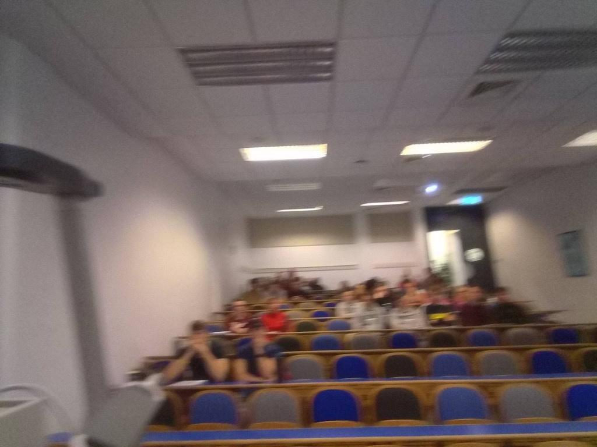
      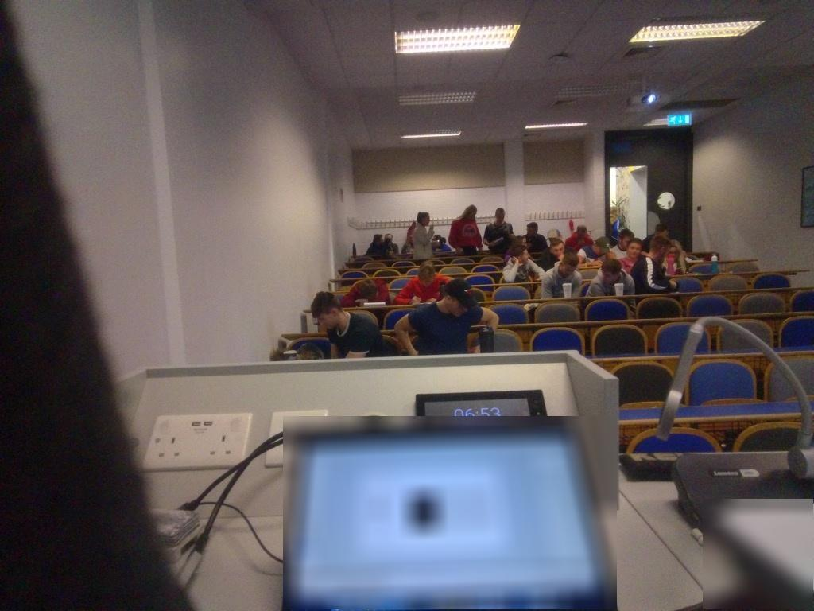
      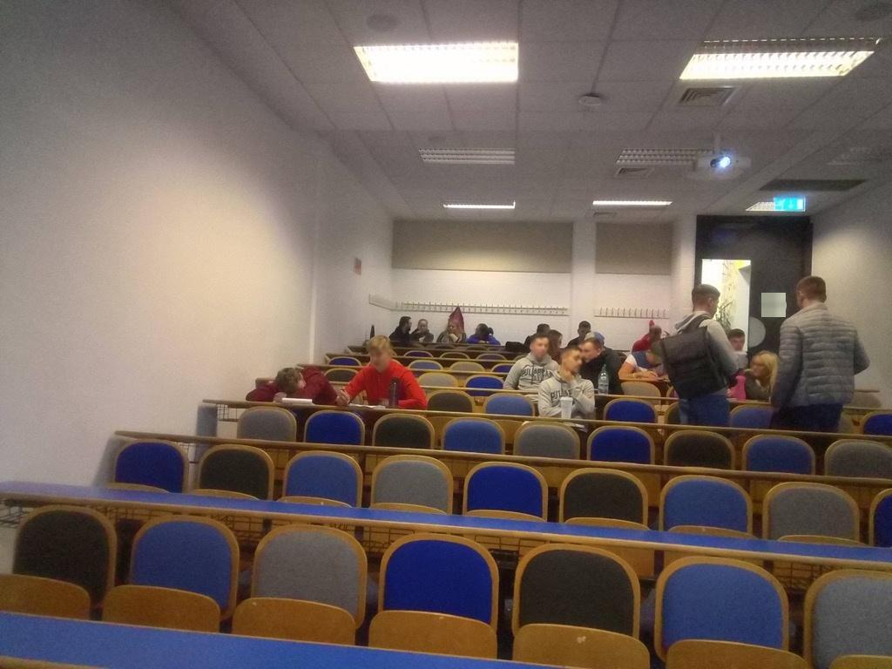
    </div>    
    
    | Hình ảnh | Main Action | Concurrent Action |
    | --- | --- | --- |
    | Ảnh 1	| attending a presentation | |
    | Ảnh 2 | using computer | attending a presentation |
    | Ảnh 3	| attending a presentation | |
    
- Các ảnh được propagate phải có **main action và concurrent action (nếu có)** giống hoàn toàn với ảnh ban đầu.
- Các ảnh không có thông tin/cam lia nhanh/chỉ có duy nhất 1 màu/không xác định được hành động gì được dán nhãn là NO ACTIVITY.

### Một số trường hợp đặc biệt
| Case | Hình ảnh | Main Label | Concurrent Label | Giải thích |
|---|---|---|---|---|
| 0a. Di chuyển trong nhà, di chuyển liên tục (nhận diện qua việc xem các ảnh liên tiếp) | 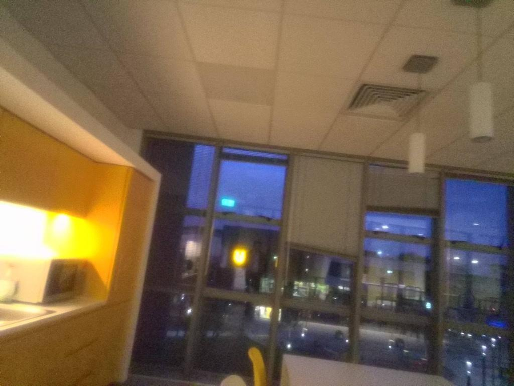 | walking indoor | *Tùy trường hợp* | |
| 0b. Trong nhà, đứng/ngồi lâu một chỗ | 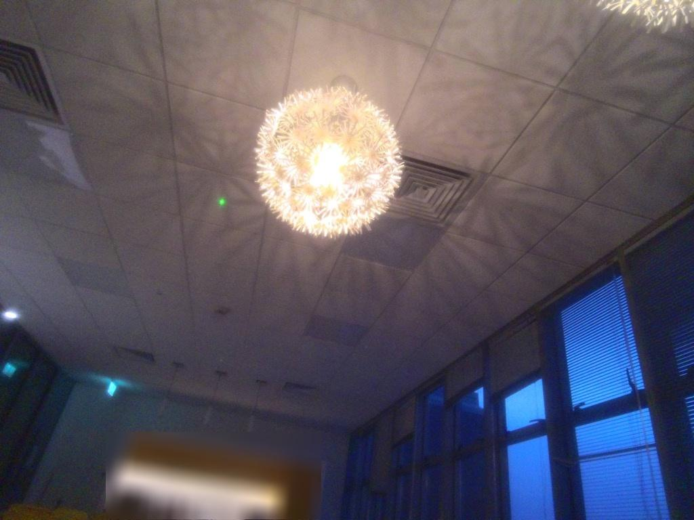 | NO ACTIVITY | |
| 1a. Giơ điện thoại lên chụp hình | 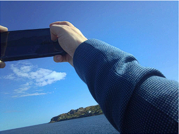 | taking a photo | using mobile device | |       
| 1b. Có điện thoại trong ảnh nhưng không chụp hình | 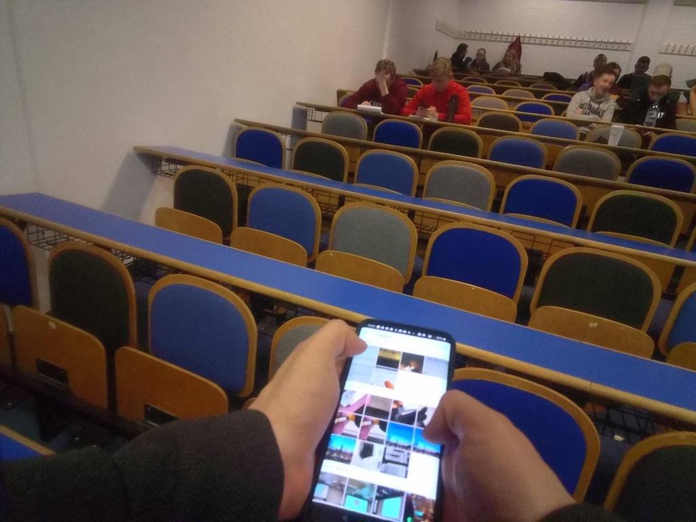 | using mobile device | *Tùy trường hợp* | |
| 2a. Ngồi ăn với 1 người nào đó (không nhìn thấy đồ ăn nhưng biết là đang ngồi ăn) |  | having a conversation | eating | |
| 2b. Ngồi ăn với 1 người nào đó, thấy đồ ăn nhưng người đối diện đang mở miệng ra nói chuyện |  | having a conversation | eating | |
| 2c. Ngồi ăn với 1 người nào đó (nhìn thấy bàn đồ ăn) |  | eating | having a conversation | |
| 2d. Ngồi uống với 1 người nào đó, thấy đồ uống nhưng người đối diện đang mở miệng ra nói chuyện |  | having a conversation | drinking | |
| 2e. Trên bàn vừa có đồ ăn, đồ uống nhưng không thấy tay cầm ly đồ uống |  | eating | *Tùy trường hợp mà drinking hoặc having a conversation* | Ưu tiên eating > having a drink |
| 3a. Cầm sách, báo, menu lên đọc | 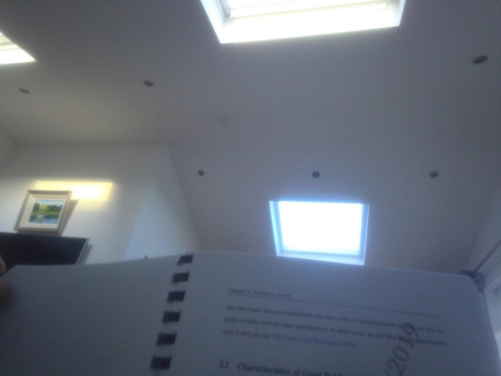 | reading documents | *Tùy trường hợp* | |
| 3b. 1 bàn giấy trong văn phòng, có nhiều giấy tờ/dụng cụ/thiết bị | 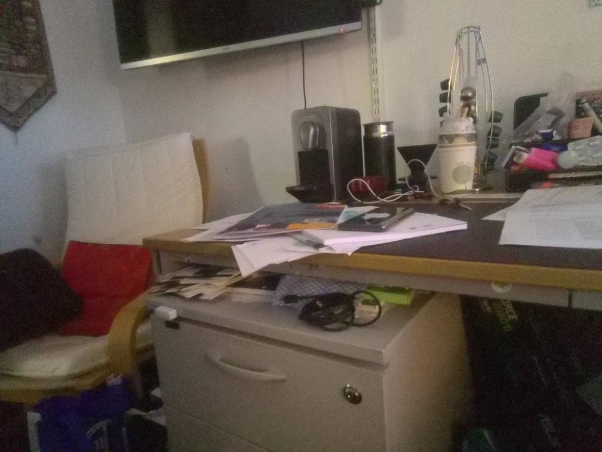 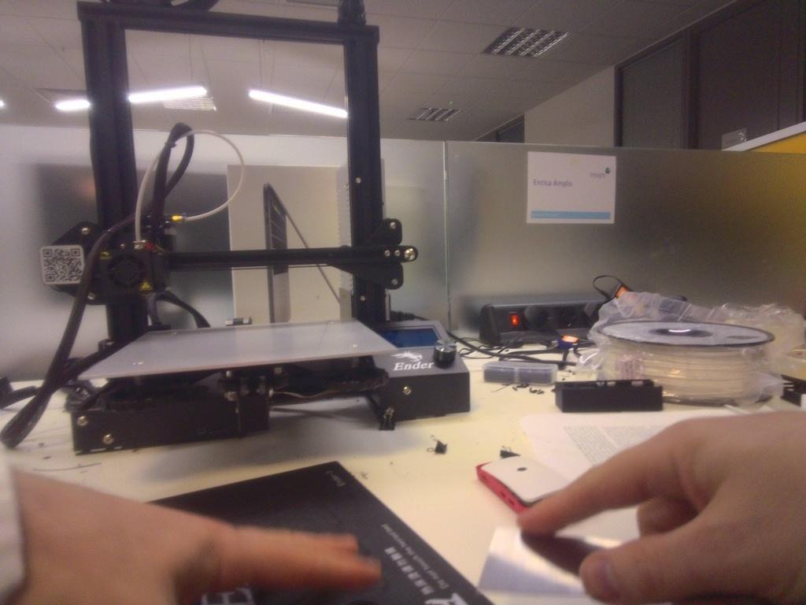 | doing office work | *Tùy trường hợp* | |
| 3c. 1 bàn giấy trong văn phòng, có nhiều giấy tờ/dụng cụ/thiết bị, có sử dụng máy tính | 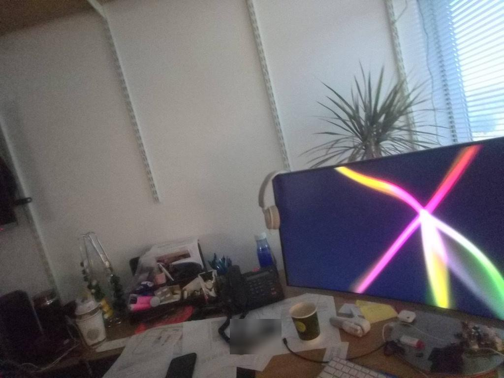 | using computer | doing office work | |
| 4a. Đi siêu thị, đang di chuyển (đi vào cửa, đi dọc các lối đi, nhòe khung hình,...) | 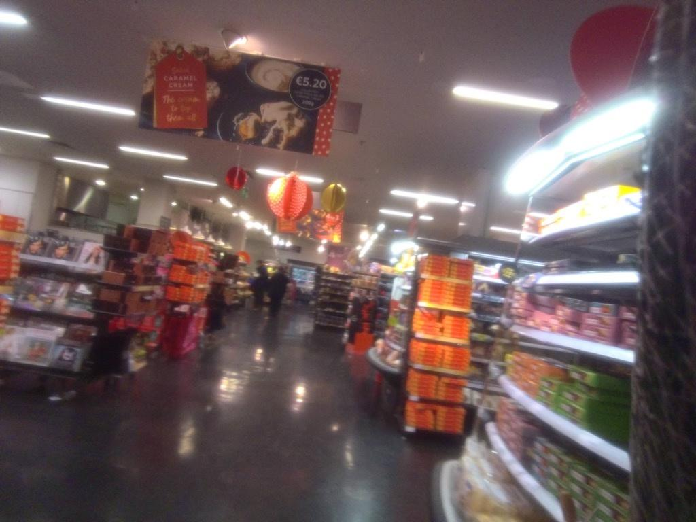 | shopping | walking indoor | |
| 4b. Đi siêu thị, đứng cận quầy sản phẩm để xem hàng/đứng ở quầy thanh toán | 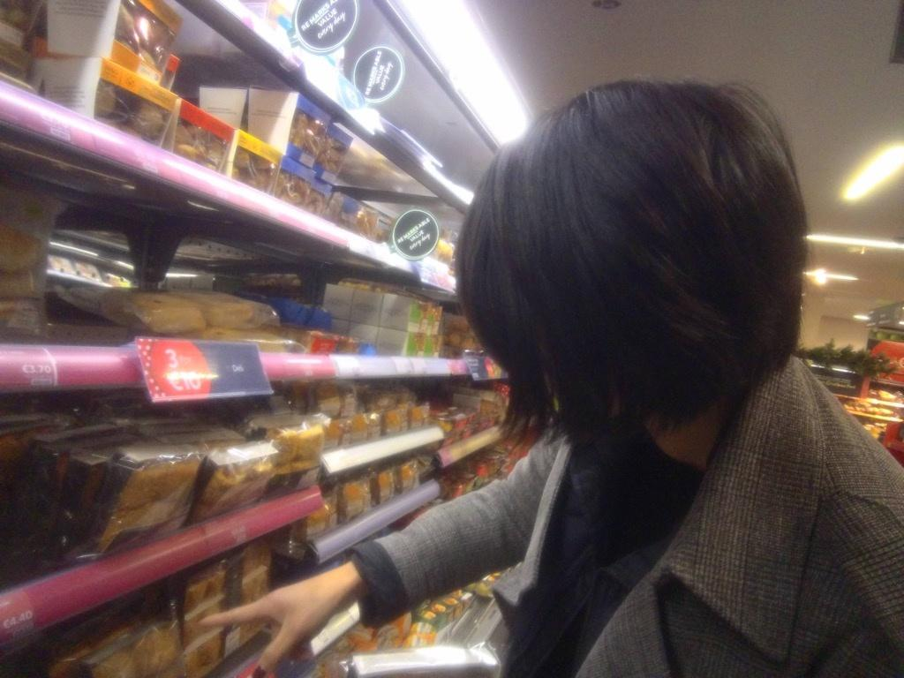 | shopping | *Tùy trường hợp* | |
| 5a. Trong lớp học/phòng họp/... có thấy slide trình chiếu | 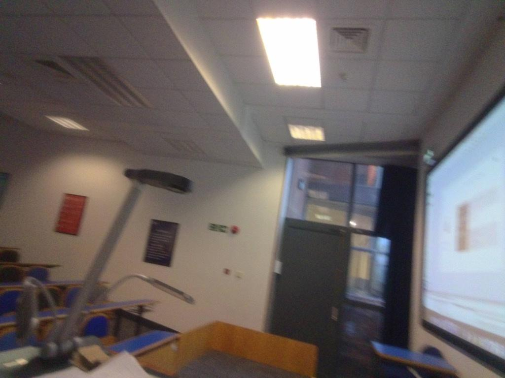 | attending a presentation | *Tùy trường hợp* | Có sử dụng slide có nghĩa là đang trình bày 1 chủ đề nào đó |
| 5b. Trong lớp học/phòng họp/... không thấy slide trình chiếu nhưng có 1 người đang trình bày ở vị trí cao hơn hẳn (có thể đứng hoặc ngồi) |  | attending a presentation | *Tùy trường hợp* | Thầy thường đứng lớp ở vị trí giảng viên |
| 5c. Trong lớp học/phòng họp/... không thấy slide trình chiếu, mọi người có vị trí ngang nhau, giống một cuộc thảo luận |  | attending a meeting | *Tùy trường hợp* | Thảo luận đơn thuần dùng lời nói để trình bày |

---

## Hướng dẫn sử dụng
1. Nhập tên file (`yyyymmdd`) vào text box **Output CSV**.
2. Click **Set** để lưu tên file.
3. Click **Load Images** và chọn thư mục cần label. Lưu ý là chọn thư mục ứng với 1 ngày (VD: `201901/01`).
4. *(Nếu cần thiết)* Điều chỉnh thanh slider **Returned Records** để giới hạn số kết quả trả về.
5. Khi ảnh hiện ra, click vào tên các label được hiển thị bên dưới để chọn label.
   - Nếu ảnh có **2 label**, sau khi chọn 2 label, cửa sổ các hình ảnh cần được propagate sẽ tự động hiện ra.
   - Nếu ảnh có **1 label**, sau khi chọn 1 label, nhấn **Tab** để cửa sổ các hình ảnh hiện ra.
   - Có thể click **Clear Labels** để xóa labels rồi dán nhãn lại.
6. Cửa sổ hiện ra các hình ảnh được app gợi ý để propagate.
   - Có thể chọn nhiều ảnh, sau đó click **Remove Selected** để không propagate sang các ảnh này.
   - Click **Submit** để xác nhận propagate các ảnh này. Thông tin dán nhãn sẽ được lưu trong file CSV.
   - Có thể click **Remove All** để không propagate ảnh nào. Khi đó không cần click **Submit**.
     - **Lưu ý**: Sau khi click **Remove All**, app sẽ hiển ra một dialog, người dùng chỉ cần click **OK** để dán nhãn ảnh tiếp theo. Tuy nhiên, đôi khi app hiện ra 2 dialog, việc click **OK** 2 lần vô tình dán nhãn 2 lần, khiến cho ảnh thứ hai bị label sai. Có thể quan sát ảnh này và sửa trực tiếp vào file CSV.
